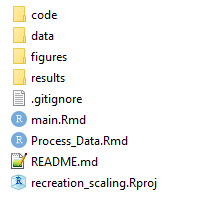

```{r setup, include=FALSE}
options(htmltools.dir.version = FALSE)
```

## Best practice for reproducible code

1. Coding style

2. Effective comments

3. Using functions

4. Defensive programming

5. Folder organisation

6. R Projects

7. R Markdown

## Why worry about best practice? 


1. It's easier to revisit a project a few months down the line

2. It's easier for others to understand what you've done

3. If you are developing code that you want to be used by others; it increases the chances they will actually use it!

# Coding style

## Style guides

The foundation of writing readable code is to choose a logical and readable coding style, and to stick to it. 

- [tidyverse style guide](https://style.tidyverse.org/)
- Key is consistency

## Meaningful file names {.build}

Firstly, using meaningful file names for your scripts can immediately improve logical consistency of a project. 

- GOOD
```{r, eval = FALSE}
01-download-data.R
02-run-my-awesome-analysis.R
03-create-nice-plots.R
```

- BAD
```{r, eval = FALSE}
abc.R
script.R
```

## Concise and descriptive object names

Similarly any objects that you create should have meaningful names so that you can easily understand what they hold (for variables) or what they do (for functions)

- variable names should typically be nouns
- function names should typically be verbs
- avoid using names of existing objects (i.e. the in-built R functions)

## Concise and descriptive object names {.build}

GOOD
```{r, eval = FALSE}
species_dat
landcover_shp
landcover_ras
calc_sprich()
```

BAD
```{r, eval = FALSE}
data_from_site_one
shapefile
Raster
my_function()
```

## Readabillity

- Spacing should be used to improve visual effect: use spaces around operators (=, +, -, etc.), and after commas (much like in a sentence).
- Indentation should be with spaces, not tabs, and definitely not a mixture of tabs and spaces
- Use consistent cases: 
  - all lower case: e.g. `speciesdat`
  - underscore separated: e.g. `species_dat`
  - lower camel case: e.g. `speciesDat`
  - upper camel case: e.g. `SpeciesDat`

# Effective comments

## Commenting code

- A line of code that is visible, but not read by the computer

- Signified with `#`

- Should be used to comment 'why' rather than 'what'. For example: 

## Commenting code {.build}

GOOD 
```{r, eval = FALSE}
# List of grid cells is required for a for loop
grid_cells = c('SU41', 'SU42', 'SU43')

# For each grid cell, calculate the species richness
for(grid in grid_cells) {
  calc_sprich(grid)
}
```

BAD
```{r, eval = FALSE}
# Setting x equal to 1
x = 1
```

## Commenting code

Comments can also be used to break the script into sections: 

```{r, eval = FALSE}
# 1. Setting variables #######################################
...
# 2. Loading data ############################################
...
# 3. Main analysis ###########################################
```

## Comments as pseudocode

This can help plan out a long script:

1. Write out the actions required in your script as plain text in comments - this helps you to consider the control flow

2. Fill in with actual code

3. As a bonus, you will have well commented code without having to add it afterwards

# Using functions

## What are functions? {.build}

- A function is a self-contained block of code that performs a single action

- R has loads of in-built functions, such as `mean` or `sd`: 

```{r}
x = c(2, 3, 4)
mean(x)
sd(x)
```

- If we were to dig around in the R source files, we could find the blocks of code that define these functions

## Why functions? {.build}

- Repeating an analysis multiple times, with different parameters
- Copying and pasting blocks of code has the potential to introduce errors
- Modularises your code to provide better structure

```{r, eval = FALSE}
species_dat <- import_data(...)
species_dat <- format_data(...)
species_dat <- filter_data(...)
sprich <- calc_sprich(...)
```

## Writing a function {.build}

Function to calculate the square of a number:

```{r}
square_number <- function(base) {
 square = base*base
 return(square)
}
```

We can then call it as we would any other function

```{r}
square_number(5) 
```

Functions should be defined before they are called. Good practice would be to save in an external script and import at the beginning of the analysis, after loading the R packages.

# Defensive programming

## Defensive programming

- Ensure code fails fast and with well defined errors

- Creates a little more work BUT will save time when debugging code

- Amounts to just adding some checks in your code (e.g. print statements to show where code has got to)

## Adding defensive programming to our function {.build}

- Let's see what happens if we try to square a string: 

```{r, error = TRUE}
square_number("hello")
```

- Okay, not the end of the world, but if we'd done lots of time-intensive geoprocessing before getting to this point, we would be livid! 

## Adding defensive programming to our function

```{r, error = TRUE}
square_number <- function(base) {
  if(!is.numeric(base)) stop("Please ensure base is numeric")
  
 square = base*base
 return(square)
}
    
square_number("hello")
square_number(2.7)
```

# Folder organisation

## Folder structure

- Example folder structure:

  

- Choose something that works for you


- Try to keep raw data separate from processed data

## Relative and absolute paths

- Absolute path: the full path to a file

  - `C:/Laura/project/code/functions.R`
  
- Relative path: the path **relative to the current working directory**

  - Assuming current working directory is 
  `C:/Laura/project`

  - the relative path would be `code/functions.R`
  
- Note: current working directory + relative path = absolute path

## Current working directory

In R we can find the current working directory using: 

```{r}
getwd()
```

## Relative vs absolute paths

- Relative paths make code more portable
  
  - You can move between computers without having to change paths
  
  - You can easily share code with colleagues (they are unlikely to have the exact same file paths as you)
  
- Absolute paths can be useful too. For example, if data are stored outside of the project folder

# R Projects

## R Projects

- Uses the one project = one folder mentality

- Self-contained project with its own workspace and history

- Automatically sets up version control

- [Using R Projects guide](https://support.rstudio.com/hc/en-us/articles/200526207-Using-Projects)

# R Markdown

## R Markdown

- Keep analysis and writing together

- Integrates code chunks in R (or bash, python, SQL, etc.) with plain text in markdown format

- Underlying data has changed? No worries, rerun the RMarkdown report and all the figures, tables, embedded values will change magically. 

- Use for reports, manuscripts, supplementary materials

- Record computational analysis in the same way as you would wet/dry lab or field notebooks

- [R Markdown guide](https://rmarkdown.rstudio.com/)

## IMPORTANT NOTE

You don't have to do all of this! Work out what is most important for you and the kind of work you do 

Build up over time

## Additional Resources

[A Guide to Reproducible Code in Ecology & Evolution](https://www.britishecologicalsociety.org/wp-content/uploads/2017/12/guide-to-reproducible-code.pdf)

[R for Data Science](https://r4ds.had.co.nz/)